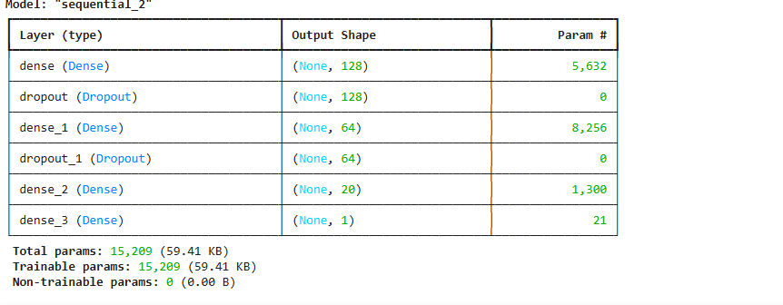
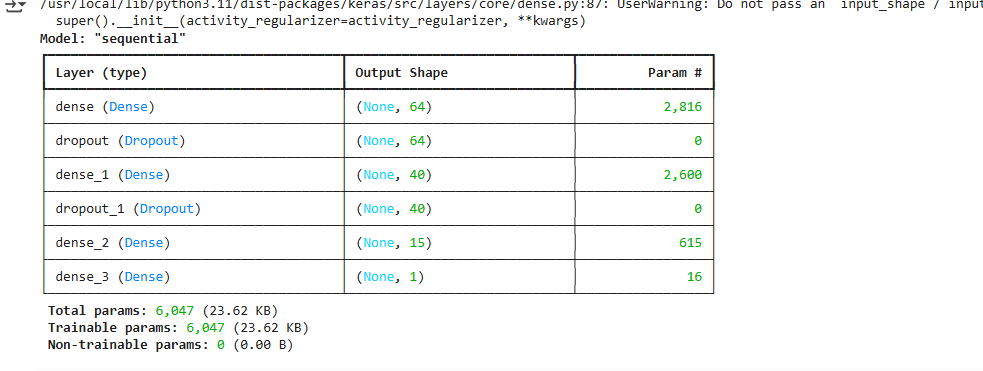

# Alphabet Soup Deep Learning Model Report

## **Overview of the Analysis**
The purpose of this analysis is to develop a deep learning model that can predict whether an organization funded by Alphabet Soup will be successful. Using a dataset of organizational features, we trained a neural network model and optimized it to improve accuracy. The goal was to achieve a predictive accuracy above 75%.

## **Results**

### **Data Preprocessing**
- **Target Variable:** `IS_SUCCESSFUL` (Binary classification: 1 for successful, 0 for unsuccessful).
- **Feature Variables:**
  - Categorical features such as `APPLICATION_TYPE`, `AFFILIATION`, `USE_CASE`, `ORGANIZATION`, `STATUS`, `INCOME_AMT`, `SPECIAL_CONSIDERATIONS`.
  - Numerical features such as `ASK_AMT`.
- **Removed Variables:**
  - `EIN` and `NAME` (Non-beneficial ID columns that do not contribute to the prediction).

### **Compiling, Training, and Evaluating the Model**

#### **Model 1** (Initial Model)
- **Architecture:**
  - **Input Features:** 86
  - **Hidden Layers:** 2 (86 → 43)
  - **Activation Functions:** ReLU (hidden layers), Sigmoid (output layer)
- **Performance:**
  - **Test Accuracy:** 73.06%
  - **Loss:** 0.5631
- **Observation:** The model performed decently but did not reach the 75% accuracy target.

#### **Model 2** (Increased Complexity & Dropout)
- **Architecture:**
  - **Input Features:** 128 → 64 → 20 → 1
  - **Dropout Layers Added**
  - **Activation Functions:** LeakyReLU & ReLU (hidden layers), Sigmoid (output layer)
- **Performance:**
  - **Test Accuracy:** 39.91%
  - **Loss:** 0.8462
- **Observation:** Overfitting occurred, leading to poor generalization and a significant drop in accuracy.

#### **Model 3** (L2 Regularization & Dropout Reduction)
- **Architecture:**
  - **Hidden Layers:** 64 → 40 → 15 → 1
  - **L2 Regularization Applied**
  - **Dropout Reduced**
  - **Activation Functions:** ReLU (hidden layers), Sigmoid (output layer)
- **Performance:**
  - **Test Accuracy:** 53.43%
  - **Loss:** 0.6910
- **Observation:** The model was more stable but failed to improve accuracy beyond 75%.

### **Steps Taken to Improve Performance**
1. **Increased model complexity** (More neurons and layers in Model 2).
2. **Implemented dropout** (Regularization to prevent overfitting in Model 2).
3. **Added L2 regularization and fine-tuned dropout** (Model 3 attempted to stabilize training but did not significantly improve accuracy).

### **Summary & Recommendations**
- **Final Accuracy:** The highest accuracy achieved was **73.06%** with Model 1.
- **Challenges:** Increasing model complexity did not improve accuracy, and overfitting was an issue.
- **Alternative Approach:**
  - A **Random Forest Classifier or XGBoost** model might be more effective for structured tabular data.
  - Feature engineering, such as creating interaction terms or additional binning, could improve the dataset.
  - Hyperparameter tuning using **GridSearchCV** or **Bayesian Optimization** could further refine the deep learning model.

🚀 **Conclusion:** The deep learning approach showed promise but did not reach the target accuracy. Alternative machine learning models may perform better for this type of classification problem.

